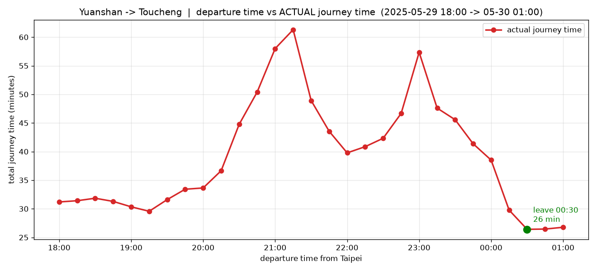

# beat-the-jam 🚗

> **幾點出發進雪隧最不塞?** 輸入走廊上的起訖點與時間窗,回傳該路段逐時段的小客車車速 / 實際行車時間曲線,幫你挑出最順的出發時間。
>
> **What time should you leave to beat the Xueshan Tunnel jam?** Give a corridor origin/destination and a time window; get back the per-bin passenger-car speed / actual travel-time curve for that segment, so you can pick the smoothest departure time.

---

## 這是什麼 / What it is

固定一條「回家走廊」(國1 北向 → 國3 → 國5 南向 → 頭城,往宜蘭方向),對歷史車速做查詢。走廊與方向由系統寫死,**不是**使用者輸入;使用者只選走廊上的起訖點與時間。

A single hardcoded *homebound corridor* (Hwy-1 N → Hwy-3 → Hwy-5 S → Toucheng, heading to Yilan) that you query for historical speeds. The route and direction are hardcoded — **not** user input; you only choose where along the corridor and when.



上圖是 `GET /journey`(圓山 `01F0213N` → 頭城 `05F0287S`,2025-05-29 連假前夕)輸出的視覺化:21:00 前後出發要塞約 **61 分鐘**,撐到 **00:30** 出發只要 **26 分鐘** —— 這正是本服務要替你找出的「最該出發的時間」。

The chart above visualizes `GET /journey` (Yuanshan `01F0213N` → Toucheng `05F0287S`, the eve of a 2025-05-29 long weekend): leaving around 21:00 costs ~**61 min**, but holding out until **00:30** takes just **26 min** — exactly the "best time to leave" this service finds for you.

## 資料來源 / Data source

- 高公局 TDCS **M05A** 公開歸檔,免認證:`https://tisvcloud.freeway.gov.tw/history/TDCS/M05A/M05A_<YYYYMMDD>.tar.gz`
- 每日檔 288 個 CSV(每 5 分鐘一筆),欄位為小客車中位數車速。回溯下限 **2021-06-22**。
- **不快取**:每次查詢即時下載當日檔、在記憶體解壓、用完即丟,不落地。
- 車速 `0` / 空值 = 偵測器離線 = 缺值,**不會**被當成「塞到 0」。

- Freeway Bureau's public TDCS **M05A** archive, no auth required (URL above).
- Each daily archive holds 288 CSVs (one per 5 min) of passenger-car median speed. History goes back to **2021-06-22**.
- **No cache**: every request downloads that day's archive, unpacks it in memory, and discards it — nothing is written to disk.
- A speed of `0` / blank means the detector was offline (missing data) and is **never** treated as "jammed to zero".

## 走廊 / The corridor

```
國1 北向 ───────────────► 汐止系統 ──(轉國3)──► 南港系統 ──(轉國5)──► 雪山隧道 ──► 頭城
三重 25.6k → 東湖 14.7k        │ 國3 南向 11.6→15.8k       │ 國5 南向 0 → 28.7k
```

10 個路段、11 個有序門架點。跨國道的轉接段(國1→國3、國3→國5)里程基準不同,長度記為 0,只當路徑接點、不計入距離。

10 segments, 11 ordered gantry points. The cross-freeway transfer segments (Hwy-1→3, Hwy-3→5) sit on different milepost bases, so their length is recorded as 0 — they connect the path but don't count toward distance.

## 快速開始 / Quick start

### Docker(最快 / fastest)

```bash
# 建立映像 / build the image
docker build -t beat-the-jam .

# 啟動服務(對外 8000 埠,Ctrl-C 結束)/ run the service (port 8000, Ctrl-C to stop)
docker run --rm -p 8000:8000 beat-the-jam

# 開互動式 API 文件 / open interactive API docs
open http://127.0.0.1:8000/docs
```

不需在本機裝 Python 或 uv。映像以 uv 官方鏡像為基底,啟動即跑 uvicorn。
No local Python or uv needed. The image is based on the official uv image and runs uvicorn on start.

### 本機 / Local (uv)

```bash
# 安裝依賴 / install deps
uv sync

# 啟動開發伺服器(--reload 熱重載)/ run the dev server (hot reload)
uv run uvicorn main:app --app-dir src --reload

# 開互動式 API 文件 / open interactive API docs
open http://127.0.0.1:8000/docs
```

需要 Python ≥ 3.12。專案為 uv application(不是可安裝套件)。
Requires Python ≥ 3.12. This is a uv *application*, not an installable package.

## 端點 / Endpoints

| 端點 / Endpoint | 回答的問題 / Answers | 輸入 / Input |
| --- | --- | --- |
| `GET /speed` | 某時段整條走廊的**瞬時**平均車速(看哪個時段路況差) / Per-bin **snapshot** speed over the corridor | 交流道**名稱** / interchange **names** (`STOPS`) |
| `GET /journey` | 出發時間 → **實際行車時間**(時間相依模擬) / Departure → **actual travel time** (time-dependent sim) | 門架 **id** / gantry **ids** (`/gantries`) |
| `GET /gantries` | `/journey` 能填哪些門架 id(純靜態,不下載) / Which gantry ids `/journey` accepts (static, no download) | 無 / none |

共用查詢參數 / Shared query params:`origin`、`destination`、`start`、`end`(ISO 8601,可跨午夜)、`bin_minutes`(預設 30,允許 5/10/15/30/60)。
驗證 / Validation:`end > start` 且跨度 ≤ 24h;日期需在 `2021-06-22`~今天;否則 **400**。上游下載失敗回 **503**。

### `GET /speed` — 瞬時車速曲線 / Snapshot speed curve

`origin`/`destination` 填**交流道名稱**(見下方 STOPS)。每個 bin 取該時段所有觀測的**距離加權調和平均**車速,代表那段時間整條路徑的真實平均速度。

Use **interchange names** for `origin`/`destination` (see STOPS below). Each bin reports the **distance-weighted harmonic mean** speed of all observations in that window — the true average speed across the path during that time.

```bash
curl "http://127.0.0.1:8000/speed?origin=南港系統&destination=頭城\
&start=2025-02-28T15:00:00&end=2025-02-28T23:00:00&bin_minutes=30"
```

```jsonc
{
  "origin": "南港系統", "destination": "頭城", "direction": "宜蘭方向",
  "bin_minutes": 30,
  "bins": [
    { "bin_start": "2025-02-28T15:00:00", "avg_speed_kmh": 38.4, "sample_count": 18, "status": "ok" },
    { "bin_start": "2025-02-28T15:30:00", "avg_speed_kmh": null, "sample_count": 0,  "status": "no_data" }
  ],
  "summary": { "overall_avg_kmh": 52.1, "slowest_bin": "2025-02-28T15:00:00", "slowest_kmh": 38.4 }
}
```

`status`:`ok` = 有資料;`no_data` = 該時段全部偵測器離線(**不是**塞到 0)。
`status`: `ok` = data present; `no_data` = every detector offline that bin (**not** zero speed).

### `GET /journey` — 出發時間 → 行車時間 / Departure → travel time

`origin`/`destination` 填**門架 id**(見 `/gantries`)。對每個出發時間做**時間相依**模擬:車子沿走廊前進,每段套用「車開到該段的那一刻」的車速;偵測器離線就沿用上一段車速,並把該筆標為 `partial`。因晚出發可能在 `end` 之後、甚至跨日抵達,下載會多抓 2 小時緩衝。

Use **gantry ids** for `origin`/`destination` (see `/gantries`). For each departure time it runs a **time-dependent** simulation: the car advances along the corridor and each segment uses the speed *at the wall-clock time the car reaches it*; an offline detector carries the previous segment's speed forward and marks that run `partial`. Since late departures may arrive after `end` (even next day), the fetch pulls a 2-hour buffer.

```bash
curl "http://127.0.0.1:8000/journey?origin=01F0256N&destination=05F0287S\
&start=2025-02-28T14:00:00&end=2025-02-28T20:00:00&bin_minutes=30"
```

```jsonc
{
  "origin": "01F0256N", "destination": "05F0287S", "direction": "宜蘭方向",
  "distance_km": 43.8, "bin_minutes": 30,
  "journeys": [
    { "depart": "2025-02-28T14:00:00", "arrive": "2025-02-28T14:38:00",
      "journey_minutes": 37.5, "effective_kmh": 70.1, "status": "ok" },
    { "depart": "2025-02-28T17:00:00", "arrive": "2025-02-28T18:05:00",
      "journey_minutes": 65.0, "effective_kmh": 40.4, "status": "partial" }
  ],
  "summary": {
    "fastest_depart": "2025-02-28T14:00:00", "fastest_minutes": 37.5,
    "slowest_depart": "2025-02-28T17:00:00", "slowest_minutes": 65.0
  }
}
```

看 `summary.fastest_depart` 就知道「該時段裡最該出發的時間」。
`summary.fastest_depart` is your answer: the best time to leave in that window.

### `GET /gantries` — 門架點清單 / Gantry reference

回傳走廊上 11 個有序門架點。`can_origin` / `can_destination` 編碼了 `/journey` 的規則:origin 必須是某段起點(首點只能當 origin),destination 必須是某段迄點(末點只能當 destination)。純靜態,不下載歸檔。

Returns the 11 ordered gantry points. `can_origin` / `can_destination` encode the `/journey` rule: an origin must be a segment start (the first point is origin-only) and a destination a segment end (the last is destination-only). Pure static data, no download.

```bash
curl "http://127.0.0.1:8000/gantries"
```

## 可填的起訖點 / Valid origins & destinations

`/speed` 用站名 / by stop name:

| 站名 / Stop | 位置 / Where |
| --- | --- |
| `國1-25k` | 三重上匝道(走廊起點) / Sanchong on-ramp (corridor start) |
| `汐止系統` | 國1 交給國3 / Hwy-1 hands off to Hwy-3 |
| `南港系統` | 國3 交給國5 / Hwy-3 hands off to Hwy-5 |
| `頭城` | 走廊終點 / corridor end |

`/journey` 用門架 id(完整 11 點請打 `/gantries`)/ by gantry id (full list via `/gantries`):

```
01F0256N → 01F0233N → 01F0213N → 01F0153N → 01F0147N
   → 03F0116S → 03F0136S → 03F0158S → 05F0000S → 05F0055S → 05F0287S
```

門架 id 格式 / id format:`<3碼國道><4碼里程×0.1km><方向>`,例 `05F0287S` = 國5、28.7k、南向。
`<3-char freeway><4-digit milepost ×0.1km><direction>`, e.g. `05F0287S` = Hwy-5, 28.7 km, southbound.

## 開發 / Development

```bash
uv run pytest          # 跑測試 / run tests
```

採 TDD:先寫失敗測試再實作。Git commit message 一律英文。
Built with TDD (failing test first). Commit messages are always in English.

## 已知限制 / Known limitations

- **單一走廊單一方向**:只服務往宜蘭的回家路線,目前不支援回程或其他路線。
  **One corridor, one direction**: only the homebound (to-Yilan) route; no return trip or other routes yet.
- **無快取**:每查一天就下載一包數十 MB 的歸檔,重複查同一天會重複下載。
  **No cache**: each queried day re-downloads a multi-MB archive, even if requested before.
- **回溯分析,非即時預測**:查的是歷史特定日期的曲線;預測未來只能靠類比過去同性質的日子。
  **Retrospective, not forecasting**: it shows a specific historical day's curve; predicting the future means looking at comparable past days yourself.
